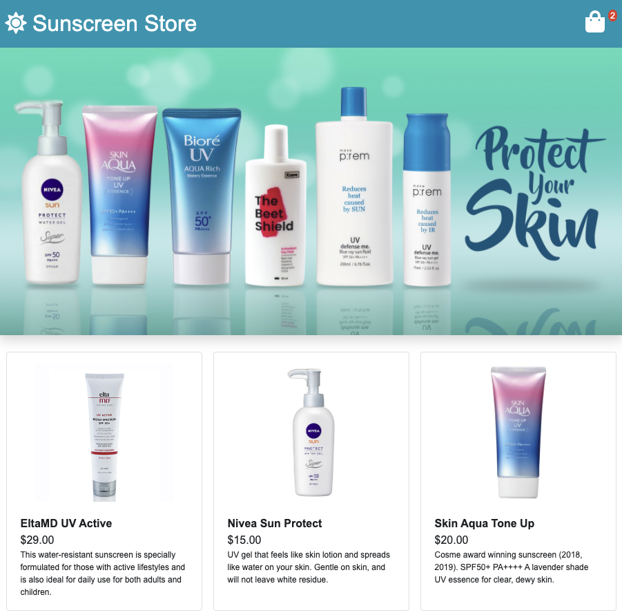

# SS-js
A full stack Node.js and React e-commerce experience with sunscreen products. ☀️🧴

## Technologies Used
- React.js
- Express.js
- Node.js
- npm
- Webpack 4
- Bootstrap 4
- PostgreSQL
- HTML5
- CSS3

## Live Demo

https://store.tracyluu.com/

## Features
- User can view the products for sale
- User can view details of a product
- User can add a product to their cart
- User can add a product to their cart
- User can view their cart summary
- User can remove item in their cart summary
- User can place an order (as long as form is valid)
- User is required to enter all fields in otder to place order
- Mobile Responsiveness

## Preview



## System Requirements

- Node.js 10 or higher
- npm 6 or higher
- PostgreSQL 6 or higher

#### Getting Started

1. Clone the repository.

```shell
git clone https://github.com/tracyluu/ss-js.git
```

2. Change directory to cloned folder
```shell
cd ss-js/
```

3. Install all dependencies with npm.
```shell
npm install
```

4. Start PostgreSQL server
```shell
sudo service postgresql start
```

5. Import the example database to PostgreSQL
```shell
npm db:import
```

6. Start the project.

```shell
npm run dev
```

7. Once started, you can view the application by opening [https://localhost:3000](https://localhost:3000)
